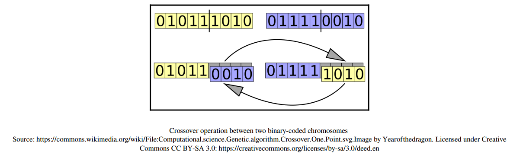

# Hands-on Genetic Algorithms with Python

## Section 1: The basics of Genetic Algorithms

### 1. An Introduction to Genetic Algorithms

- Drawing inspiration from Charles Darwin's theory

- Evolutionary computation
  - Genetic algorithms

  1. What are genetic algorithms?
  - A family of search algorithms.
  - By mimicking Darwinian natural selection and reproduction, these algorithms
  can produce high-quality solutions pertaining search, optimization, and learning
  that would otherwise be hard to come by.
  - Suitable for problems with large number of parameters and complex math
  representations.
  - Darwinian evolution
    - *Variation:* Individual traits may vary.
    - *Inheritance:* Some traits are passed on to the offspring.
    - *Resemblance:* Offspring resemble their parents more than unrelated other.
    - *Selection:* Survival of the fittest to reproduce.
    - *Crossover/Recombination:* Offspring have a mix of their parents traits.
    - *Mutation:* Random change(s) to one or more genes.

- The genetic algorithm analogy
  - Whereas Darwinian evolution maintains a population of individual specimens,
  genetic algorithms maintains a population of possible solutions (individuals).

  - Genotype
  This is a collection of genes that are grouped into chromosomes.
  This collection facilitates reproduction and mutation.
  Each chromosome of the offspring will carry a mix of genes from parents genotype.
  e.g. A single gene: `010111010`

  - Population
  A collection of solution for the problem at hand is maintained.
  e.g. A population: `010111010 000101010 110111110 010011011 010110000`

  - Fitness function
  Aka target function. The function/problem we seek to optimize/solve.
  Individuals are evaluated every time based on the fitness function.
  The evolution process stops once the solution has been found within a given
  fitness value.

  - Selection
  Individuals with high fitness value are more likely to be chosen for the next cycle.
  Low fitness may still be selected but with a lower probability.

  - Crossover
  To create a pair of new individuals, two parents are chosen from the current generation. Parts of their chromosome interchanged (crossed over) to create new offspring.

    

  - Mutation
  Periodically and randomly refresh the population. Introduce new patterns into the chromosomes, and encourage search in uncharted areas of the solution space.

  2. The theory behind genetic algorithms.
  - Behind the concept of genetic algorithms is the *building block hypothesis*. Small building blocks assembled together to obtain an optimal solution to the problem. This is guided by a superior fitness score.

  - The **schema theorem** is the Holland's fundamental theorem of genetic algorithms. Schemata are patterns/templates that can be found within chromosomes.
  e.g. if a set of chromosomes is represented by binary strings, the schema `1*01` represents all those chromosomes that have a `1` in the leftmost position, and `01` in the rightmost position.

  - The *order* of the schema is the number of digits that are fixed (not *)
  - The *defining length* of the schema is the distance between the furthermost fixed digits.

  - *The schema theorem states that* the frequency of schemata of low order, short defining length, and above-average fitness increases exponentially in successive generations.

  3. Differences between genetic algorithms and traditional algorithms.
  - There are various differences between genetic algorithms and say, gradient-based algorithms:
    - Maintaining a population of solutions
    - Using a genetic representation of the solutions
    - Utilizing fitness function
    - Exhibiting probabilistic behavior
  - In genetic representations, the solution search is decoupled from the original problem domain.
  - Genetic algorithms are not aware of what the chromosome represent.
  - Genetic algorithms do not rely on derivatives or any other information, except the value of the fitness function. This makes them suitable to *handle functions that are hard or impossible to mathematically differentiate*.
  - Despite the probabilistic nature of the process of genetic algorithms, the overall search for a solution is not random; the direction is towards a better chance to to improve the next generation results.
  > Genetic algorithm steer towards the highest fitness function value, while gradient descent steer towards the direction of lower cost function.

  4. Advantages and limitations of genetic algorithms.
   * Global optimization capabilities.
   * Handling problems with complex mathematical representation.
   * Handling problems that lack mathematical representations.
   * Resilience to noise.
   * Support for parallelism and distributed processing.
   * Suitability for continuous learning.

   ##### Global optimization
   * Sometimes you have the best solution to your problem but not the best in overall. This is the case with local maxima and minima points. Traditional gradient-based algorithms get stuck in these local points rather than finding the global optimum points. Genetic algorithms are less prone to this problem.

   ##### Handling a lack of math representation
   * A case in point is when the fitness score is based on human opinion.
   * Machine learning car driver can have various solutions. A genetic algorithm can be used to tune by having various solutions compete with each other and eventually come up with a better solution.

   ##### Withstand noise
   Some systems such as sensors, may give you a different output when provided with the same input. This behavior can easily throw off many traditional algorithms but GA may stand resilient to this noise.

   ##### Parallelism
   Operations of GA can performed concurrently. This makes GA a great candidate for distributed and cloud-based implementation.

   ##### Continuous learning
   In nature, evolution never stops. GAs can operate in an ever changing environment. At any instant, the best solution can be fetched and used. The changes in the environment has to be slow in relation to generation turnaround.

   ##### Limitations of GAs
    - Need for special definitions
    - Need for hyperparameter tuning
    - Computationally intensive
    - Risk of premature convergence
    - No guaranteed solution

   ##### Special definitions
   - When applying GAs to a problem, suitable representation for that problem must be formulated. To appropriately define the fitness function, chromosome structure, the selection, crossover, and mutation may be challenging and time consuming. Be that as it may, due to wide application of GAs, some of these definitions have been standardized.

   ##### Hyperparameter tuning
   - The behavior of GAs is controlled by hyperparameters, which are not cast on stone. With experience and practice, one is able to come up with sensible choices.

  5. When to used genetic algorithms.
