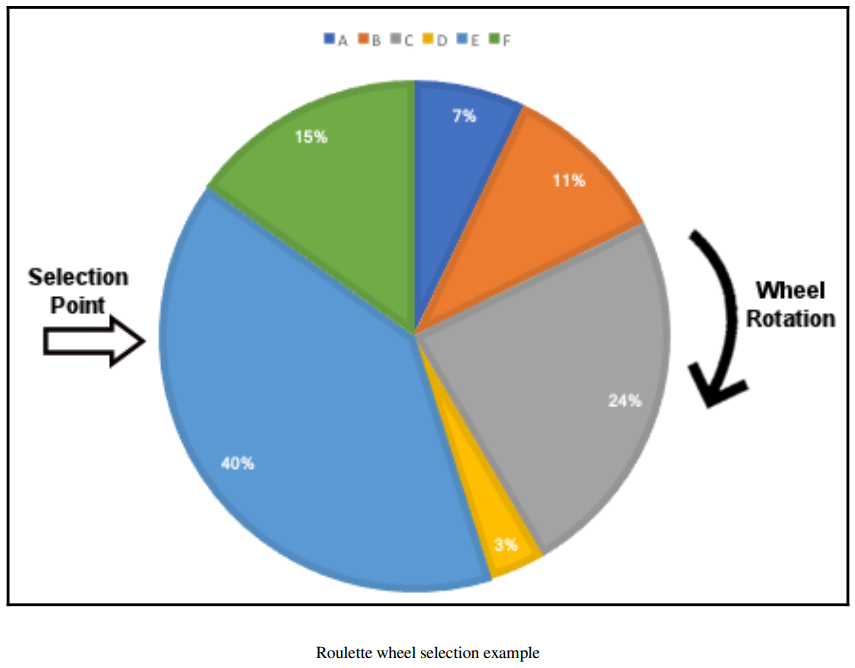

### 2. Understanding the key components of GAs

#### Basic flow of a genetic algorithm

`[Start]-->[Generation Zero]-->[Selection]-->[Crossover]-->[Mutation]
-->[Individual Fitness]-->[Stopping condition met?]`  
`[No]-->[Go back to Selection]`  
`[Yes]-->[Pick Highest Fitness Individual]-->[End]`

##### Creating initial population
- Initial population is basically a set of valid solutions (individuals) chosen randomly. GAs use chromosomes to represent individuals.

##### Calculating the fitness
- To begin with, fitness function is calculated for each individual. Fitness for each individual is independent of others. Since the next iteration involves the best fitness score, GAs are hence steered by maximum/minimum value(s).
- Then Selection --> Crossover --> Mutation --> Stopping condition

##### Stopping condition
- The two common stopping conditions are:
 - A maximum number of generations have been reached.
 - There was no noticeable improvement over a couple of generations.
- Other stopping conditions include:
 - Predetermined timeout.
 - A certain budget has been depleted.
 - The best individual has taken over a portion of the population larger than a preset threshold.

##### Summary (a loop)
 - *Selection* based on *fitness function*
 - *Crossover*
 - *Mutation*
 - *Stopping* based on a *Stopping condition*

##### Selection methods
- *Roulette wheel selection* (fitness proportionate selection, *FPS*)  
The probability of selecting an individual is directly proportional to its fitness value.

Each time the wheel is turned, the selection point is used to choose a single individual. This process is repeated until enough individuals are selected to fill the next generation.

- *Stochastic universal sampling* (SUS)  
This method uses the Roulette wheel above but uses multiple equispaced selection points to pick many individuals once and for all. This prevents individuals with particularly high fitness score from saturating the next generation. In reference to Roulette method, this is unfair.

- *Rank-based selection*  
Roulette method is used to sort the individuals. An individual with the lowest fitness is given a rank 1, the second lowest rank 2, and so on. New probabilities are then calculated based on these ranks as opposed to the fitness score. The wheel selection is the same as the Roulette single selection point. This eliminates individual saturation and damps large or tiny differences.

- *Fitness scalling*  
While rank-based selection replaces fitness score with the individual rank, fitness scaling applies a scaling transformation and replaces the fitness value with the result. A scaling transformation may take the following form:
`scaled fitness = a*(raw fitness)+b`, where a and b are constants chosen to achieve a desired range.
This method provides a moderate proportion of the roulette wheel.

- *Tournament selection*  
Here, two or more individuals are picked at random and the highest in fitness out of the randomly picked becomes the winner. The "two or more" picked at random is referred to as the *tournament size*. The larger the tournament size, the more chances there are of getting a high fitness individual.
In this method, the actual value of fitness may not be needed, since we can compare any two individuals to determine which one of them is better.*

##### Crossover methods
Crossover operator is aka recombination, corresponds to the biological sexual reproduction crossover (the exchange of genetic material during sexual reproduction). Whenever crossover is not applied, both parents are directly cloned into the next generation. The following methods are useful but in some cases, it might be better to use problem-specific crossover methods.
- Single-point crossover - location on the chromosomes of both parents is selected at random, then swapped.
- Two-point and k-point crossover - Two crossover points on the chromosomes are randomly selected from both parents. k positive integer, and k crossover points.
- Uniform crossover - Each gene is independently selected by randomly choosing one of the parents.
- Crossover for ordered lists
- Ordered crossover

##### Mutation methods
This is the last process to be applied in the process of applying new generation. It applies to the offspring that were created as a result of selection and crossover.
- Mutation is probability-based and usually occurs at a low probability since it has a risk of harming the performance of an individual.
- *Flip-bit mutation*  
One or several gene(s) is randomly selected from a binary chromosome and its value flipped (0 changed to 1 or 1 changed to 0).
- *Swap mutation*  
In this case, two values are randomly selected and interchanged.
- *Inversion mutation*  
Here, random sequence of genes is randomly selected and the order reversed.
- *Scramble mutation*  
A random sequence of genes is selected and the order of genes in that sequence is shuffled.

#### Real-coded genetic algorithms
- Instead of using binary strings, array of real-valued numbers were found to be a simpler and better approach.
- The crossover and mutation operations are applied separately for each dimension of the array the forms the real-coded chromosome.
- For example, if [1.23,7.213,-25.39] and [-30.10,100.2,42.42] are parents selected for the crossover operation, the crossover will be separately done for the following pairs:  
`1.23 and -30.10` (first dimension)  
`7.213 and 100.2` (second dimension)  
`-25.39 and 42.42` (third dimension)  
- Similarly, the mutation operator, when applied to a real-coded chromosome will apply separately to each dimension.

#### Blend crossover
- Each offspring is randomly selected from the following interval created by its parents: `[parent1 - a(parent2-parent1), parent2 + a(parent2-parent1)]`
- The parameter `a` is a constant, whose value lies between 0 and 1. With the larger values of a, the interval gets wider.
- Let the parents be `1.33` and `5.72`
  - Taking `a = 0.0`, the interval `[1.33,5.72]` is similar to the parents interval
  - For `a = 0.5`, interval `[-0.865,7.915]` is twice as wide
  - `a = 1.0`, `[-3.06,10.11]` is three times wider
  - Value `0.5` is commonly use for blend crossover

#### Simulated binary crossover
- Imitates the properties of the single point crossover that's commonly used with binary-coded chromosomes.
- The average of the parents' values is equal to that of the offsprings' values.
- The two offspring are created from the two parents using the following formula:
`offspring1 = 0.5[(1+b)parent1 + (1-b)parent2]`  
`offspring2 = 0.5[(1-b)parent2 + (1+b)parent2]`
-`b` is a random number referred to as a random factor.
- The average of the two offspring is equal to that of the parents regardless of the value `b`.
- When `b` is `1` the offspring are duplicates of parents.
- When `b` is less than `1`, the offspring are closer to each other than the parents were.
- When `b` is larger than `1`, the offspring are further apart from each other than the parents were.
- Preserve the similarity between offspring and parents

#### Real mutation
One option for applying mutation in real-coded genetic algorithms is to replace any real value with a brand new one that has been generated randomly. However this can result to a mutated individual that has no relationship with the parents/original parents.

- Another option is to generate a random real number that resides in the vicinity of the original individual.
- In *normally distributed (Gaussian) mutation*, a random number is generated using a normal distribution with a mean value of zero and some predetermined standard deviation.

#### Understanding elitism
While the average fitness of the genetic algorithm population generally improves, it is possible to lose the best individual in the next generation. In most cases, this loss is temporary.
- To ensure that the best individuals always make it to the next generation, we employ elitism. This strategy duplicates the top `n` individuals to the next generation.
- Elitism saves time wasted in re-discovering the lost individuals and it is a potential performance boost.

#### Niching and sharing
In nature, any environment is sub-divided into niches (sub-environments). Various inhabitants take advantage of the available resources. When several species coexist in the  same niche, pressure builds up and there's tendency to search for other unpopulated niches. This ensures diversity and several optimal solutions.
- In most implementations of GA, you may want to identify the global maximum. In some applications, you may also want to retain some or all other maximums even though they are minimums. In such an application, you consider each local maximum point as a niche.

#### Serial niching vs parallel niching
The niching concept described above might prove hard to implement because it increases the complexity of the fitness calculation.
- To get around these hurdles, serial niching is implemented (finding peaks one at a time instead of parallel niching - all at the same time).
- In serial niching, GA is used as usual to find the best solution and then upgrade the fitness function so that the area of maximum point is flattened and the process is repeated.
